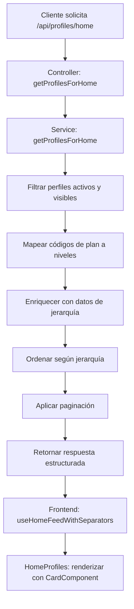

# Módulo de Jerarquía de Perfiles

## Descripción General

Este módulo implementa un sistema de jerarquía y ordenamiento automático para perfiles basado en planes, upgrades y actividad del usuario. El sistema prioriza la visibilidad de perfiles según su nivel de plan y upgrades activos.

## Arquitectura del Sistema

### Backend

#### Endpoint Principal
- **Ruta**: `GET /api/profiles/home`
- **Controlador**: `profile.controller.js::getProfilesForHome`
- **Servicio**: `profile.service.js::getProfilesForHome`
- **Modelo**: `profile.model.js`, `plan.model.js`

#### Lógica de Jerarquía

1. **Filtrado Inicial**:
   - Solo perfiles activos (`isActive: true`)
   - Solo perfiles visibles (`visible: true`)
   - Excluye perfiles con `lastShownAt` en las últimas 24 horas

2. **Mapeo de Planes**:
   ```javascript
   const planLevelMap = {
     'premium': 3,
     'plus': 2,
     'free': 1
   };
   ```

3. **Enriquecimiento de Datos**:
   - Nivel del plan actual
   - Upgrades activos (boost, highlight)
   - Fecha de última actividad
   - Fecha de creación

4. **Ordenamiento Jerárquico**:
   1. **Boost activo** (descendente)
   2. **Highlight activo** (descendente)
   3. **Nivel del plan** (descendente: Premium > Plus > Free)
   4. **Última actividad** (descendente)
   5. **Fecha de creación** (descendente)

5. **Paginación**:
   - Parámetros: `page` (default: 1), `limit` (default: 12)
   - Respuesta incluye metadatos de paginación

### Frontend

#### Componentes Principales

1. **HomeProfiles.tsx**
   - Componente principal para mostrar perfiles en home
   - Consume el hook `useHomeFeedWithSeparators`
   - Renderiza perfiles usando `CardComponent`

2. **useFeeds.ts**
   - Hook `useHomeFeedWithSeparators` para obtener datos
   - Función `getHomeFeed` que consume `/api/profiles/home`
   - Manejo de paginación y estados de carga

3. **CardComponent**
   - Componente reutilizable para mostrar perfiles
   - Ubicación: `@/components/Card/Card`
   - Props: `profiles: IProfile[]`

## Definiciones de Negocio

### Planes

1. **Free (Nivel 1)**
   - Plan básico gratuito
   - Menor prioridad en ordenamiento

2. **Plus (Nivel 2)**
   - Plan intermedio de pago
   - Prioridad media en ordenamiento

3. **Premium (Nivel 3)**
   - Plan premium de pago
   - Mayor prioridad en ordenamiento

### Upgrades

1. **Boost**
   - Impulso temporal de visibilidad
   - Máxima prioridad en ordenamiento
   - Duración limitada por fechas `startAt` y `endAt`

2. **Highlight**
   - Destacado visual del perfil
   - Segunda prioridad en ordenamiento
   - Duración limitada por fechas `startAt` y `endAt`

### Reglas de Visibilidad

1. **Filtro de Actividad**
   - Perfiles con `lastShownAt` en últimas 24h son excluidos
   - Previene saturación de los mismos perfiles

2. **Estado del Perfil**
   - Solo perfiles activos (`isActive: true`)
   - Solo perfiles visibles (`visible: true`)

3. **Validación de Upgrades**
   - Solo upgrades dentro del rango de fechas válidas
   - Verificación de `startAt <= now <= endAt`

## Flujo de Datos



## Estructura de Respuesta

```typescript
interface ProfilesHomeResponse {
  profiles: IProfile[];
  pagination: {
    currentPage: number;
    totalPages: number;
    totalProfiles: number;
    hasNextPage: boolean;
    hasPrevPage: boolean;
  };
  metadata: {
    levelSeparators: any[]; // Vacío, ordenamiento manejado por backend
  };
}
```

## Configuración y Parámetros

### Variables de Entorno
- No requiere configuración adicional
- Usa configuración estándar de base de datos

### Parámetros de Query
- `page`: Número de página (default: 1)
- `limit`: Elementos por página (default: 12, máximo: 50)

## Manejo de Errores

1. **Backend**
   - Errores de base de datos retornan 500
   - Parámetros inválidos retornan 400
   - Logging detallado para debugging

2. **Frontend**
   - Estados de carga y error en hooks
   - Fallbacks para datos vacíos
   - Retry automático en caso de fallo

## Optimizaciones

1. **Base de Datos**
   - Índices en campos de filtrado (`isActive`, `visible`, `lastShownAt`)
   - Proyección de campos necesarios únicamente

2. **Frontend**
   - Cache de datos con React Query
   - Paginación para reducir carga inicial
   - Lazy loading de imágenes

## Testing

### Backend
```bash
# Ejecutar tests del controlador
npm test -- profile.controller.test.js

# Ejecutar tests del servicio
npm test -- profile.service.test.js
```

### Frontend
```bash
# Ejecutar tests de componentes
npm test -- HomeProfiles.test.tsx

# Ejecutar tests de hooks
npm test -- useFeeds.test.ts
```

## Monitoreo y Métricas

1. **Métricas de Rendimiento**
   - Tiempo de respuesta del endpoint
   - Número de perfiles retornados por consulta
   - Distribución de niveles de plan

2. **Métricas de Negocio**
   - Efectividad de upgrades en visibilidad
   - Patrones de actividad de usuarios
   - Conversión de planes gratuitos a pagos

## Mantenimiento

1. **Actualizaciones de Planes**
   - Modificar `planLevelMap` en el servicio
   - Actualizar documentación de niveles

2. **Nuevos Upgrades**
   - Agregar lógica en `getProfilesForHome`
   - Actualizar ordenamiento jerárquico
   - Documentar nuevas reglas de negocio

## Versionado

- **v1.0.0**: Implementación inicial con jerarquía básica
- **v1.1.0**: Optimizaciones de rendimiento y cache
- **v1.2.0**: Nuevos tipos de upgrade y métricas

---

**Última actualización**: Diciembre 2024
**Mantenido por**: Equipo de Desarrollo Backend
**Contacto**: dev-team@company.com